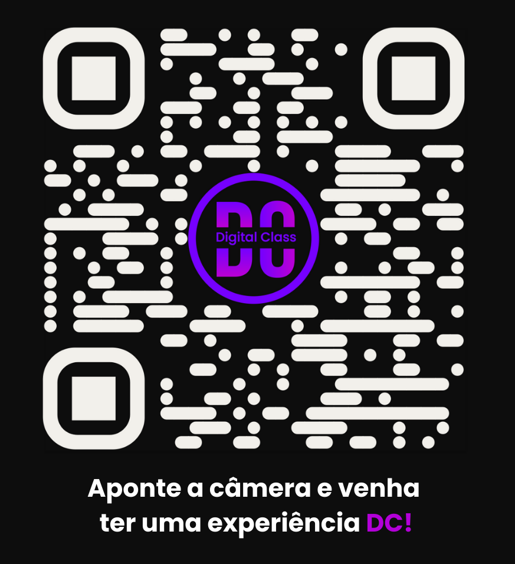

Bem-vindos ao nosso TCC na Obra Social Dom Bosco!

Somos uma startup de Educação Digital Personalizada, com mais de 20 anos de experiência no mercado educacional, especializada na preparação de alunos para vestibulares de grande concorrência, como Fuvest, Unicamp e Fatec.

Nosso diferencial é o uso de inteligência artificial avançada para personalizar o aprendizado de cada aluno, garantindo um ensino de qualidade e eficiente. Além disso, contamos com unidades presenciais que complementam o ensino digital, proporcionando um atendimento ainda mais próximo e focado no desenvolvimento do estudante.

Com uma alta taxa de aprovação nos principais vestibulares, nossa missão é transformar a trajetória educacional dos nossos alunos, proporcionando as ferramentas e estratégias necessárias para o sucesso nos exames e no futuro acadêmico.

<a href="https://christianmoreira98.github.io/TCC---Digital-Class/home.html">Acesse também por aqui!</a>